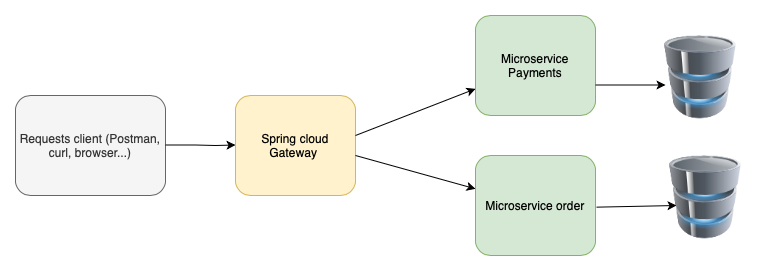

# Microservice repository 

This is a repository of microservices built with Spring boot, 
Eureka Service Register, Eureka Service discovery,  Circuit breaker Resilience4J, API Gateway, OpenFeign and Mysql as database.

## Summary
* [Microservice repository](#microservice-repository)
    * [Summary](#summary)
    * [About](#about)
    * [Architecture Diagram](#architecture-diagram)
    * [Technologies](#technologies)
    * [How to run](#how-to-run)
      * [Run with Docker compose](#run-with-docker-compose)
      * [Example of Requests](#example-of-requests)
    * [Load Balance](#load-balance)
    * [Development Status](#development-status)
    * [Future Development](#future-development)
    * [Contributors](#contributors)

## About
This repository consists is to learn more about microservices with Spring framework.

Specific in this case was used asynchronous communication between two microservices, 
Payments and Order Payments using Spring cloud feign, an Api Gateway to do the load balance and Service register.
In the future I will refactor to use asynchronous communication with Apache kafka.

## Architecture Diagram


## Technologies

- Java 17
- Spring boot 2.7.4
- MapStruct
- Spring Cloud API Gateway
- Spring Eureka Server and Discovery
- Resilience4J Circuit breaker
- Flyaway migration database
- Maven 3.8.6

## How to run

First install all dependencies necessaries.
```
mvn clean install
```

### Run with Docker compose
Download all microservices and in your favorite console run:

If you have docker and docker compose installed, you can run just executing:
```
docker-compose.yml up
```
### Run with spring-boot:run command line

After execute the following command:
**Important: make sure you are at the same directory of pom.xml**
On each module run:
```
mvn spring-boot:run
```
### Example of requests
In order to do the request, I will explain the structure of url.
All requests have to pass through Api Gateway so the port is `localhost:8082`, if you already have this port in use 
just modify the port in .yml file from Api Gateway. 
After `localhost:8082` just put the of microservice that you want, for e.g. `localhost:8082/ms-order` and finally the resource
`localhost:8082/ms-order/order`. 

Let`s see some examples of requests bellow:

To Get a Payment by a specific id: 
```
http://localhost:8082/ms-payments/payments/1
```
To Get all Payments:

```
http://localhost:8082/ms-payments/payments
```

To create a new Order (method Post):
```js
localhost:8082/ms-order/order
```
Body of request:
```js
{
    "items": [
        {
            "quantity": 1,
            "description": "XBOX Series X"
        },
        {
            "quantity": 1,
            "description": "Macbook Por 16 pulgadas"
        },
        {
            "quantity": 1,
            "description": "Ordernador Gamming"
        }
    ]
}
```

## Load Balance
All microservices are implemented with Spring Cloud that are manager with load balance.
In order to see the load balance in action you can use this endpoint:

```js
http://localhost:8082/ms-order/order/port
```
For each request this will show a different port. That is the Load Balance running.

## Development Status 

- [x] Creation of ms-payments and ms-order.
- [x] Creation of Api Gateway.
- [x] Implementation of Spring Eureka service register and service discovery.
- [x] Implementation of fallback circuit breaker with Resilience4j.
- [x] Communication between microservice with Spring Feign client.

## Future Development

- [ ] Creation of unity tests and integration test.
- [ ] Apply Oauth authentication.
- [ ] Asynchronnous communication with Apache kafka.
- [ ] Deploy on cloud using docker.

## Contributors
[@LauroSilveira](https://github.com/LauroSilveira)

Fell free to fork and contribute :wink: